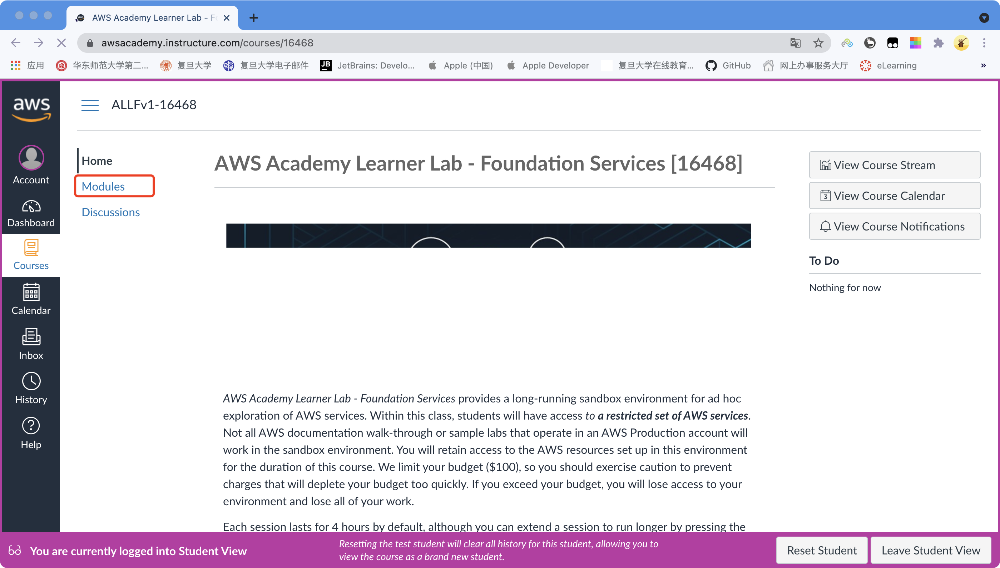
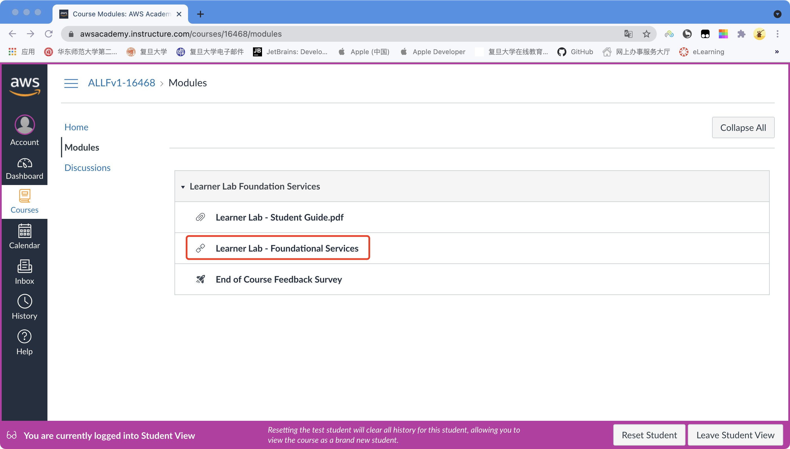
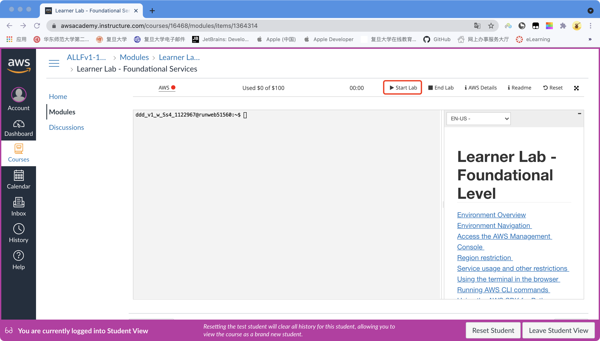
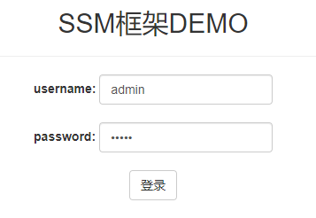
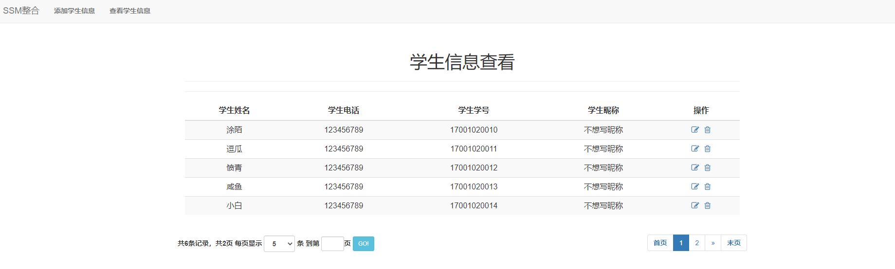

# Advanced Web Technology Lab1 (ssm demo)

> 19110240021 夏家峰
>
> 18302010018 俞哲轩

## 概述

Lab1的**主要任务**包括：

1. **基本任务**
   - 学习使用AWS Academy
   - 重点掌握Docker
   - 使用Docker在AWS Academy提供的服务器上部署一个简易的ssm程序
     - 详细代码见**`./ssm-demo/`**文件夹
   - 撰写实验报告并提交
2. **进阶任务**
   - 学习使用AWS Academy
   - 自行查阅资料并部署一个简易的Web3D项目
     - 详细代码见**`./html5-demo/`**文件夹
   - 撰写实验报告并提交

## Part 1：使用AWS Academy

使用自己的账号登录AWS Academy，进入课程页面

点击**Modules**按钮



点击**Learner Lab - Foundational Services**按钮



可看到云服务器操作界面，点击**Start Lab**按钮，即可开始Lab实验



## Part 2：学习Docker

**Docker**是一个开源的应用容器引擎，让开发者可以打包他们的应用以及依赖包到一个可移植的镜像中，然后发布到任何流行的Linux或Windows机器上，也可以实现虚拟化

推荐同学们先去阅读**`./materials/`**文件夹下的**`快速理解Docker.pdf`**和**`Docker最佳实践.pdf`**，对Docker建立初步的了解

## Part 3：使用Docker并部署ssm应用

### 准备Docker环境

1. AWS Academy云服务器中已经预装了Docker
2. 使用`docker version`命令验证Docker是否已经安装
3. 如果Docker未安装，可以使用Docker官方文档的步骤来安装Docker，文档链接[见此](https://docs.docker.com/install/linux/docker-ce/ubuntu/)，请注意，安装的是**Docker CE**版本
4. 安装成功后，使用`docker verison`命令查看docker是否安装成功

### 编写Dockerfile

```shell
mkdir maven_tomcat
cd maven_tomcat
vim Dockerfile
```

```dockerfile
FROM maven:3.6.3-jdk-8

ENV CATALINA_HOME /usr/local/tomcat
ENV PATH $CATALINA_HOME/bin:$PATH
RUN mkdir -p "$CATALINA_HOME"
WORKDIR $CATALINA_HOME
ENV TOMCAT_VERSION 8.5.64
ENV TOMCAT_TGZ_URL https://downloads.apache.org/tomcat/tomcat-8/v$TOMCAT_VERSION/bin/apache-tomcat-$TOMCAT_VERSION.tar.gz
RUN set -x \
&& curl -fSL "$TOMCAT_TGZ_URL" -o tomcat.tar.gz \
&& tar -xvf tomcat.tar.gz --strip-components=1 \
&& rm bin/*.bat \
&& rm tomcat.tar.gz*
EXPOSE 8080
CMD ["catalina.sh", "run"]
```

解释：在一个maven基础镜像上叠加tomcat，最终运行java项目时只需要这一个镜像即可完成编译+打包+部署。

build此基础镜像

```shell
sudo docker build -t maven_tomcat .
```

使用`-t`参数指定镜像名称：标签，`.`表示使用当前目录下的 Dockerfile, 还可以通过-f 指定Dockerfile所在路径。

此时运行`docker images`应该可以看到一个叫`maven_tomcat`的镜像。

### 内网实例安装mysql

见**`./materials/mysql安装.pdf`**

关键是保证安装完以后可以被远程访问

### 构建应用镜像

基于此镜像， 将java应用通过maven编译打包到tomcat webapps目录，生成最终镜像

```shell
git clone https://github.com/iceiceiceYu/2022-Advanced-Web-Lab.git
cd 2022-Advanced-Web-Lab/lab1/ssm-demo/code
```

此时有两件事要做：

一是在私网实例中建数据库`ssm_demo`并执行目录中的sql语句建表

二是在**`/src/main/resources/resource/jdbc.properties`**文件中修改host、用户名和密码等。

### 运行容器

修改好配置文件后，在**`2022-Advanced-Web-Lab/lab1/ssm-demo/code`**目录下，执行

```shell
docker build -t docker_demo .
```

最后，基于镜像，运行容器

```shell
# 创建并启动一个名为demo的docker容器，主机的8001端口映射docker容器的8080端口
sudo docker run -idt --name demo -p 8001:8080 docker_demo
# 模拟HTTP请求，测试浏览器是否能正常访问  
curl localhost:8001
```

### 运行结果

如果一切正常，就可以通过服务器公网IP:8001浏览器访问你的项目

使用**用户名admin****，**密码admin**登录



平台截图



## Part 4：部署Web 3D应用

自行查阅资料，并部署Web 3D应用

代码见**`2022-Advanced-Web-Lab/lab1/html5-demo/单机版`**目录下

## Part 5：提交

- 截止时间：**2022.4.3 23:59:59**
- 提交方式：将**文档**提交到超星指定的Lab1作业栏里，文档格式不限
- 提交要求：Lab1提交包括简单的描述文档、部署后的访问页面截图、学习心得等
- 评分标准：完成**基本任务**可以获得本次Lab的**满分**，如果完成**进阶任务**可以酌情获得**额外加分**